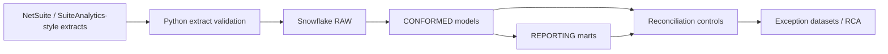

# NetSuite Financial Reporting Integration

Independent hands-on data engineering project modeling a NetSuite-style financial reporting integration into Snowflake.

> **Portfolio scope:** This repository uses synthetic data and NetSuite/SuiteAnalytics-style structures for learning and demonstration. It does not contain proprietary employer or customer data and does not claim production access to NetSuite.

## Project Objective

Build an end-to-end financial data pipeline that extracts NetSuite-style transaction data, loads it into Snowflake-oriented raw tables, transforms it into conformed financial models, and validates reporting outputs through repeatable reconciliation controls.

The project focuses on common financial engineering problems:

- Transaction and transaction-line grain management
- Account, subsidiary, department, class, accounting-period, currency, and journal relationships
- Incremental ELT with watermark controls
- Schema-change and datatype validation
- Primary/foreign-key integrity checks
- Income statement and balance sheet reporting models
- Debit/credit, posting-period, account, and subsidiary reconciliation
- Duplicate-line, missing-reference, join-cardinality, and currency mismatch RCA
- Exception datasets for investigation and remediation

## Technology

- **Snowflake SQL** — raw, conformed, and reporting layers; MERGE-based incremental ELT
- **Python** — synthetic extract generation, schema validation, data-quality checks, optional Snowflake loading
- **SuiteAnalytics-style extracts** — CSV files representing common NetSuite financial entities
- **GitHub Actions** — lightweight Python tests and SQL linting

## Architecture



## Data Model

The project models these core entities:

- `transaction`
- `transaction_line`
- `account`
- `subsidiary`
- `department`
- `class`
- `accounting_period`
- `currency`
- `journal` / journal-style transactions

The central reporting grain is **transaction line**, enriched with transaction header and financial dimensions.

## Repository Structure

```text
.
├── data/sample/                  # Synthetic SuiteAnalytics-style extracts
├── docs/
│   ├── data_model.md             # Modeling assumptions and relationships
│   └── rca_playbook.md           # Troubleshooting scenarios and remediation
├── sql/
│   ├── 00_setup.sql              # Databases, schemas, control tables
│   ├── 01_raw_tables.sql         # RAW layer DDL
│   ├── 02_conformed_models.sql   # Dimensions + financial fact table
│   ├── 03_incremental_elt.sql    # MERGE patterns and load control
│   ├── 04_reporting_views.sql    # Income statement / balance sheet views
│   ├── 05_reconciliation.sql     # Financial validation controls
│   ├── 06_rca_queries.sql        # Root-cause-analysis query library
│   └── 07_exception_capture.sql  # Persist failed controls for investigation
├── src/
│   ├── generate_sample_data.py   # Creates realistic synthetic source extracts
│   ├── validate_extracts.py      # Schema, key, duplicate, and financial checks
│   └── load_to_snowflake.py      # Parameterized Snowflake loader
├── tests/test_validations.py
├── .github/workflows/ci.yml
├── .env.example
└── requirements.txt
```

## Quick Start

### 1. Create synthetic source extracts

```bash
python src/generate_sample_data.py
```

### 2. Validate the extracts locally

```bash
python src/validate_extracts.py --data-dir data/sample
```

### 3. Run tests

```bash
pytest -q
```

### 4. Deploy Snowflake objects

Run the SQL files in numeric order. The scripts assume a project database named `NETSUITE_FINANCE_DEMO` with schemas:

- `RAW`
- `CONFORMED`
- `REPORTING`
- `CONTROL`

### 5. Optional: Load CSV extracts to Snowflake

Copy `.env.example` to `.env`, populate your own Snowflake connection values, and run:

```bash
python src/load_to_snowflake.py --data-dir data/sample
```

## Key Engineering Patterns Demonstrated

### Incremental ELT

The pipeline maintains a load watermark in `CONTROL.LOAD_CONTROL`. Source rows newer than the last successful watermark are staged and merged into target models. Each run records start time, end time, source row count, target row count, status, and error message.

### Financial Reconciliation

Controls compare:

- Source vs target record counts
- Transaction-line uniqueness
- Total debit vs total credit for journal-style activity
- Posting-period alignment
- Account/subsidiary balances
- Income-statement and balance-sheet reporting totals
- Missing or inactive dimension references
- Currency consistency

Failed controls write to `CONTROL.RECON_EXCEPTION` for investigation.

### Root Cause Analysis

The RCA query library covers:

- Many-to-many join multiplication
- Duplicate transaction lines
- Orphaned dimension keys
- Inactive dimensions used by posted transactions
- Posting date vs accounting period mismatch
- Currency mismatch between transaction and subsidiary
- Unbalanced journal entries
- Late-arriving updates
- Pipeline/load-control failures

## Example Resume Description

**NetSuite Financial Reporting Integration | Independent Hands-on Project**

- Modeled NetSuite-style transaction, transaction-line, account, subsidiary, department/class, accounting-period, currency, and journal structures in Snowflake for income-statement, balance-sheet, and reconciliation use cases.
- Built incremental ELT patterns from SuiteAnalytics-style extracts into raw, conformed, and reporting layers with schema-change detection, datatype checks, relationship validation, and repeatable load controls.
- Implemented reconciliation controls for record counts, debit/credit totals, posting periods, subsidiary/account balances, and reporting outputs, with exception datasets for investigation.
- Troubleshot join-cardinality issues, duplicate transaction lines, missing references, inactive dimensions, currency/period mismatches, and pipeline failures using SQL-based RCA and documented remediation steps.

## Disclaimer

NetSuite is a trademark of Oracle. This project is an independent educational/portfolio implementation using synthetic data and publicly understood ERP/data-engineering concepts.
